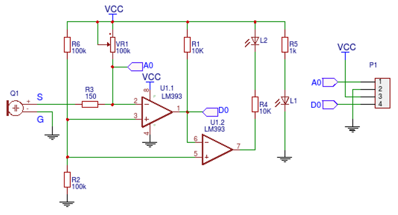

# Some notes

## Microphone sensor KY-037

- frequency range: 50Hz...22kHz
    - i.e. is this the bandwidth? i.e.
- seems like A0 and D0 is basically the same signal, but D0 is amplified.
- potentiometer to adjust voltage level, i.e. adjust signal amplitude
- i guess the microphone can be thought of as some kind of capacitor with some impedance lets say time-dependent impedance $Z(t)$, depending on the membranes configuration and accordingly the instantaneous capacity. accordingly, the voltage on the opamp input depends on the microphones capacity, which can be adjusted via the potentiometer
- probably response time of microphone and opamp are not quick enough for high frequencies, but should be suitable up to some relevant spectral ranges especially in lower frequency domain

## Serial communication
- Arduino utilizes serial communication to transmit data to computer
- Typical Arduino baud rates: 300, 600, 1200, 2400, 4800, 9600, 14400, 19200, 28800, 31250, 38400, 57600, 115200 bps
- Caution:
    - The term "baud rate" seems slightly misleading in serial communication context. Here, it refers to transmitted amount of bits per second instead of symbols per second. I.e. one signal transition from one transmission bin to the other is always 1->0 or 0->1, i.e. this is kinda like on-off-keying.
    - In Arduino, they utilize the term baud-rate for actually referring to bitrate, i.e. bits/second instead of symbols/second, as a symbol in serial communication is either 0 or 1

## Arduino ntk
### Sampling rate
- according to [1], the sampling rate of the Arduino ADC depends on the "minimum duration of the loop-function".
- This duration is lower bounded by 100us, such that one analogRead() is performed every 100us, i.e. the sampling rate to be 10kHz
- To try: measure the sampling rate by yourself, i.e. measure duration from one point of the loop-function to the next point and see how long the entire loop has taken
- This also implicates that the sampling rate depends on the code in the for loop. Highest sampling rate if only analogRead; the more code, the lower the sampling rate
- Question: If a baudrate of 115200 bps is possible, and each sampled value (e.g. 2.523 V) requires 10 bit ()

## References:
- [1]: https://forum.arduino.cc/t/sampling-rate-in-arduino/1097624/10